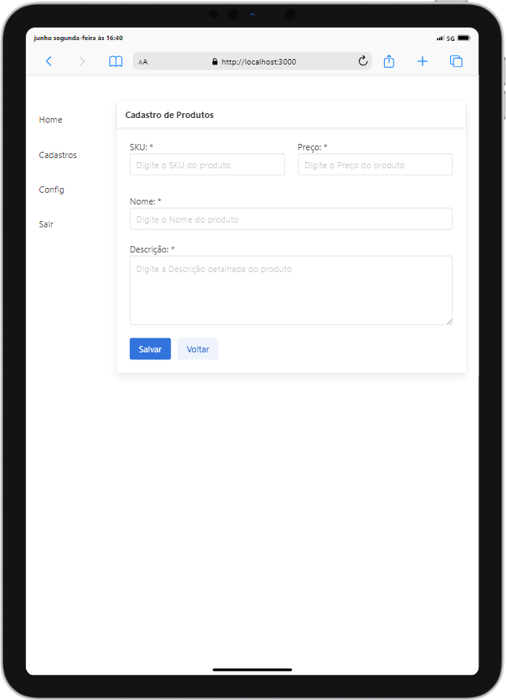

<h1 align="center">
    <p>App De Vendas 💵💳</p>


</h1>

<h1 align="center">
    
   
</h1>

## 📕 Sobre

**App de Vendas** é um projeto que estou aplicando na pratica meus conhecimentos e estudos para conseguir uma aplicação completa e funcional usando a framework NextJs, ganhando mais experiencia no desenvolvimento web.

## 🔨 Ferramentas Usadas até o Momento

<div style="display: inline-block;">
        <a href="https://nextjs.org/" target="_blank" style="display: block; margin-bottom: 10px;">
            
        </a>
        <a href="https://www.typescriptlang.org/" target="_blank" style="display: block; margin-bottom: 10px;">
            
        </a>
        <a href="https://nodejs.org/" target="_blank" style="display: block; margin-bottom: 10px;">
            
        </a>
        <a href="https://www.javascript.com/" target="_blank" style="display: block; margin-bottom: 10px;">
            
        </a>
        <a href="https://bulma.io" target="_blank" style="display: block; margin-bottom: 10px;">
            
        </a>
    </div>

## ♻️ Como Contribuir

```bash
  # Clonar o Projeto
  $ git clone https://github.com/yanrobert10/app-vendas.git

```

```bash
  # Entar no Diretorio
  $ cd app-vendas

```

```bash
  # Instalar dependências. if use npm
  $ npm install

```
```bash
  # Iniciar o Projeto
  $ npm run dev
```

<p>OU</p>

```bash
  # Instalar dependências. if use yarn
  $ yarn install
```

```bash
  # Iniciar o Projeto com yarn
  $ yarn dev
```

## Licença
 Este projeto está sob licença MIT. Veja o arquivo
[LICENSE](./LICENSE) para mais detalhes.